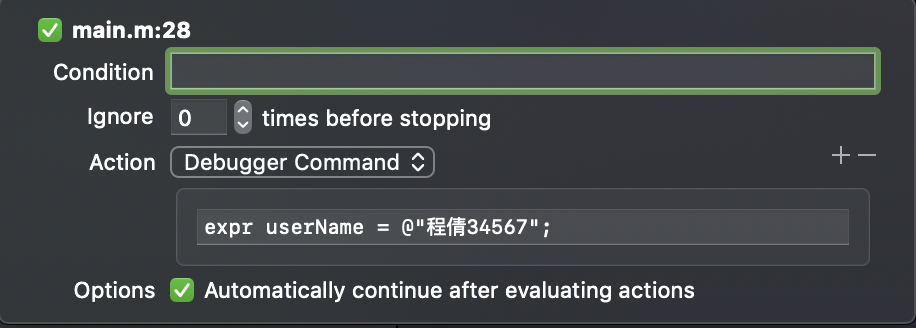
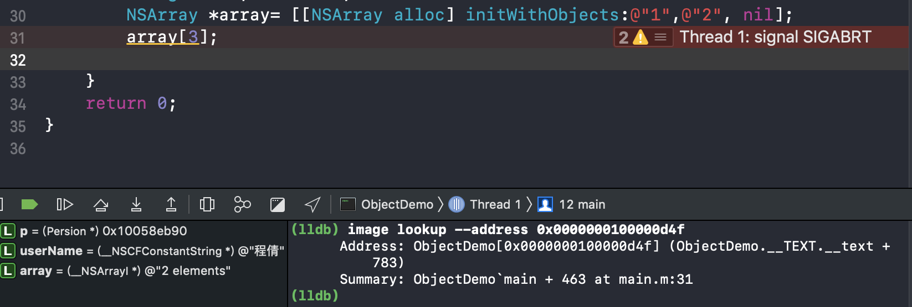
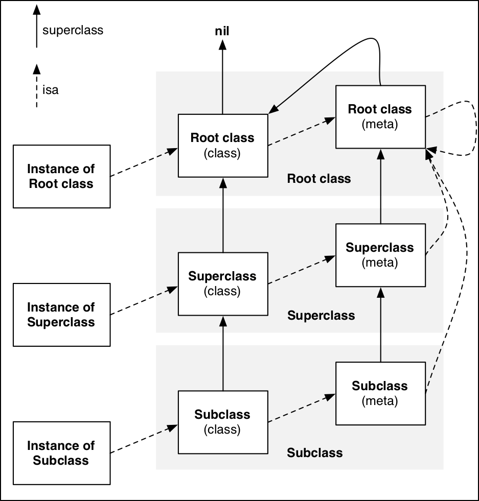
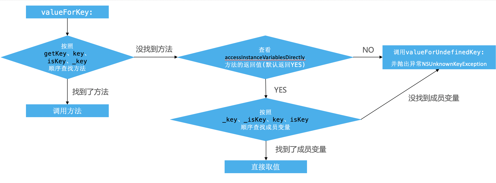

###OC的基础
#####将Objective-C代码转换为C和C++代码的几种方式
* clang -rewrite-objc main.m -o 输出的cpp文件 
* xcrun -sdk iphoneos clang -arch arm64 -rewrite-objc OC源文件 -o 输出的cpp文件 这个方法可以指明平台和架构

####苹果源码地址点击
* 苹果源码地址点击[这里](https://opensource.apple.com/tarballs/)去下载。

####Xcode调试和常用的lldb调试指令
* p (print) 主要功能是用来输出基本数据类型，int,float,double,bool 等
* po(print object) 主要功能是输出objective-c中对象的信息 和p 类似 自己测试 po 对象名 = 新生产的对象 也可以修改某个变量的值。
* expr (expression) 可以用来修改变量的值 expr 变量名 = 要赋的值。也可以在Xcode中右键 Edit Breakpoint 可以编辑断点直接进行调试  在action中输入需要修改的变量的值 如果Automaticall选项，代表运行到这个断点的时候会直接修改变量的值，不进入调试模式，不勾选会直接进入调试模式。action中也可以输入其他指令
* 设置断点的触发条件，在上图中如果在condition中输入断点的触发条件 等于是告诉编译器，符合输入的条件的时候这个断点才能生效。
* bt 显示当前线程的堆栈
* bt all 显示所有线程的堆栈
* image 这个命令可以用来寻址，主要作用是用于寻找栈地址对应的代码位置 如图： 可以根据栈地址查找到代码对应的位置。
*  memory read  读取内存中的值 格式：memory read 内存地址
*  memory write 修改内存中的值 格式：memory write 内存地址 值

####一个OC对象在内存中如何布局？
* sizeof，class_getInstanceSize，malloc_size 这三个方法有什么区别。
	* sizeof:不是一个函数，只是一个运算符，在程序编译的时候会直接得到结果。 
	* class_getInstanceSize：这个函数是获取当前传入参数的类，在创建一个实例对象的时候需要分配多少存储空间。
	* malloc_size	：计算当前类对象占用了多少存储空间，系统在分配内存的时候会考虑内存对齐问题，在iOS设备中分配的内存都是16的倍数。所以这个方法计算出来的大小一般情况下会比class_getInstanceSize 大一些
* 查看源码在libMalloc这个源码库中。
* OC的instonce（实例对象在内存中如何布局）
	* 实例对象只存储isa指针，和成员变量。 
* OC的Class(class对象):每个类在内存中有并且只有一个Class对象，Class对象在内存中存储的信息主要包括 isa指针，superclass指针,类的属性信息（@property）,类的对象方法信息（instance method）,类的协议信息（protocol）,类的成员变量信息（ivar）,获取到类的Class  可以直接通过类对象的class方法  或者类的class方法 或者 object_getClass(类的instance对象) 来获取到类的Class对象
* metaClass对象 可以通过object_getClass(类的Class) 方法获取到当前类的metaClass对象，一个类有，并且只有一个metaClass对象。metaClass中存储的有isa指针，superclass指针，类的类方法信息（classmethod）
* objc_getClass :看源码实现 这个方法接收一个字符串参数，返回这个字符串类名所对应的类对象。（为什么这个方法返回的是类对象呢？因为返回类对象，可以直接使用其他方法获取到metaClass对象，否则如果直接返回metaClass对象的，通过metaClass对象无法获取到Class对象）
* object_getClass：源码中返回了当前对象的isa指针，当蚕食是一个instance对象的时候，返回的是这个类的类对象，所以当前类的instance的isa指针指向的是当前类的Class对象，而参数是Class对象的时候 返回的是当前类的原类对象，所以当前类的Class对象的isa指针指向的是metaClass对象
* class_isMetaClass() 可以通过这个方法来判断传入的参数是否是这个类的metaClass.

#####isa指针和superclas指针

* instance的isa指向class
* class的isa指向基类的metaClass
* class的superclass指向父类的Class,如果没有父类，superclass指针为nil
* metaClass的superclass指向父类的metaClass
* 基类的metaClass的superclass指向基类的class
* instance调用对象的方法轨迹，isa找到class,如果方法不存在就通过superclass找到父类
* class调用类的方法轨迹：isa找到metaClass,如果方法不存在，就通过superclass找到父类

* 从64bit开始，isa指针需要进行一次位运算才能计算出真实的地址。和ISA_MASK做一次位运算。

#####KVO的底层实现
*补充KVO的相关资料
#####KVC
* setValue:forKey: 和 setValue:forKeyPath: 的区别。
* 使用KVC设置值能触发KVO吗？KVC修改了Key，会自动触发KVO监听，不管这个对象的Class中有没有set方法的实现，没有set方法会手动触发KVO
* setValue:forKey:的原理

* valueForKey:的原理

