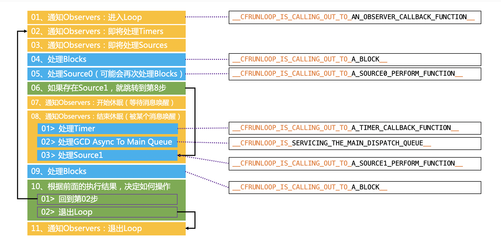

##RunLoop笔记

[toc]

###RunLoop定义
* Runloop：运行循环，在程序运行的过程中循环做一些事情。
* 如果没有RunLoop,程序代码执行完，就直接结束退出了。
* runLoop的作用：保持程序的持续运行，处理App中的各种事件，比如触摸事件，定时器事件，节省cpu资源，提高程序性能。
* iOS中可以通过Foundation库的NSRunLoop和CFFoundation的CFRunLoopRef来访问和使用RunLoop对象。
* NSRunLoop是对CFRunLoopRef的一层封装，CFRunLoopRef是开源的，[CFRunLoop源码点击这里下载](https://opensource.apple.com/tarballs/CF/)

###RunLoop和线程之间的关系
* 每个线程都有唯一的一个与之对应的RunLoop对象。
* RunLoop保存在一个全局的Dictionary里，线程作为key，RunLoop作为value.
* 线程刚刚创建的时候没有RunLoop对象，RunLoop会在第一次获取它的时候创建（会先从字典中查找，如果没有，会创建一个新的对象）
* RunLoop会在线程结束的时候销毁。
* 主线程的RunLoop已经自动创建，子线程默认没有开启RunLoop。

###获取RunLoop对象
* Foundation
	* [NSRunLoop currentRunLoop]; 获取当前线程的RunLoop对象
	* [NSRunLoop mainRunLoop];获取主线程的RunLoop对象

* CoreFoundation
	* CFRunLoopFetCurrent();获取当前线程的RunLoop对象
	* CFRunLoopGetMain(); 获得主线程的RunLoop对象

###CFRunLoop的底层结构
* RunLoop相关的类
	* CFRunLoopRef
	* CFRunLoopModeRef
	* CFRunLoopSourceRef 
	* CFRunLoopSourceTimerRef
	* CFRunLoopObserverRef

 

* CFRunLoopModeRef代表RunLoop的运行模式
* 一个RunLoop会包含若干个Mode，每个Mode又包含很多个Source0/Source1/Timer/Observer
* RunLoop启动时只能选择其中一个Mode作为currentMode
* 如果要切换Mode,只能退出当前的Loop，再重新选择一个Mode进入
	* 不同Mode的Source0/Source1/Timer/Observer能分隔开来，互不影响
* 如果Mode里没有任何Source0/Source1/Timer/Observer,RunLoop会立马退出 (怎么才能测试一下)
* 常见的2中Mode
	* kCFRunLoopDefaultMode(NSDefaultRunLoopModel) :app默认的Model,通常主线程是在这个Model下运行
	* UITrackingRunLoopMode:界面跟踪Model,用于ScrollView追踪触摸滑动，保证界面滑动的时候不受其他Model影响

* sources0:触摸事件处理,performSelector:onThread:
* sources1:基于Port的线程间通信
* Timers：NSTimer,performSelector:withObject:afterDelay:
* Observers:用于监听RunLoop的各种状态，UI刷新（BeforeWaiting）,Autorelease pool (BeforeWaiting)

###RunLoop的运行逻辑
* 01、通知Observers:进入loop
* 02、通知Observers:即将处理Timers
* 03、通知Observers:即将处理Sources
* 04、处理blocks
* 05、处理Sources0（处理完Sources0可能会再次处理Blocks）
* 06、如果存在Sources1，就跳转到第8步
* 07、通知Observers:开始休眠（等待消息唤醒）
* 08、通知Observers:结束休眠 (被某个消息唤醒)
	* 01、处理Timer
	* 02、处理GCD AsyncToMainQueue
	* 03、处理Source1
* 09、处理blocks
* 10、根据前面的执行结果，决定如何操作
	* 01 回到第02步 
	* 02 退出Loop
* 11、通知Observers:退出Loop 

###RunLoop的线程保活

