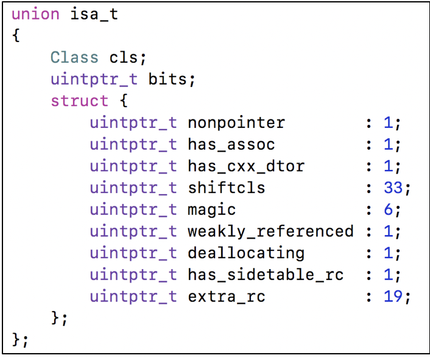
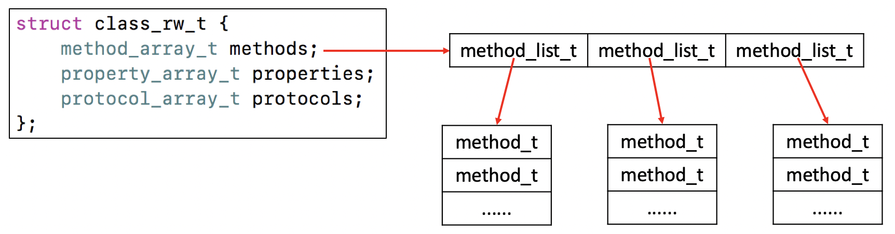
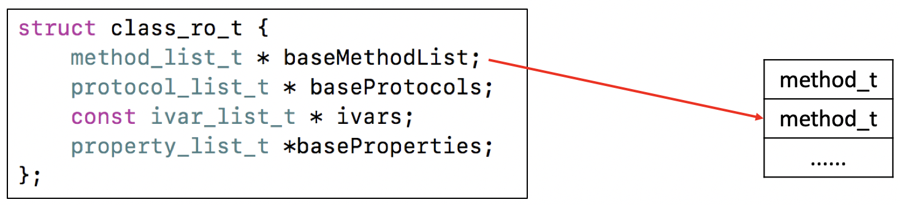
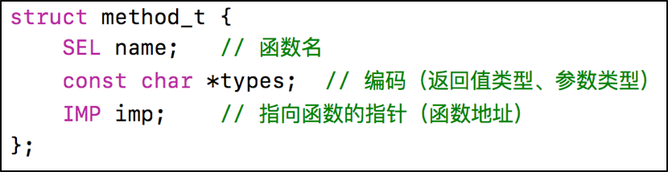
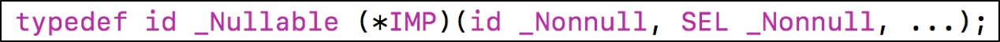
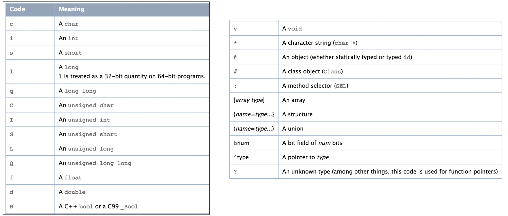
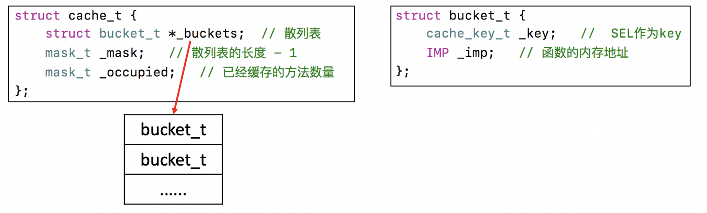
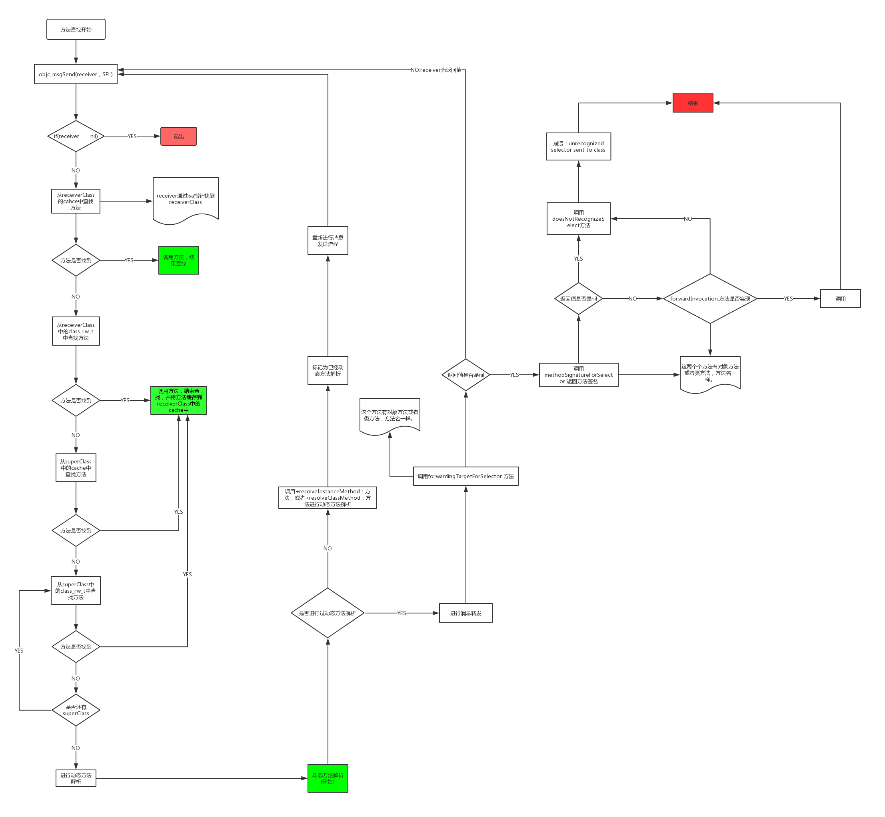

## Runtime
###isa指针详解
* 在arm64架构之前，isa就是一个普通的指针，存储这Class，Meta-Class对象的内存地址
* 从arm64架构开始，对isa指针进行了优化，变成了一个共用体(union)结构，还使用了位域来存储更多的信息。

* nonpointer
	* 0 代表普通的指针，存储着Class，Meta-Class对象的内存地址
	* 1 代表优化过，使用位域存储更多的信息

* has_assoc
	* 是否有设置过关联对象，如果没有，释放订单时候会更快，只要设置过，值就为1

* has_cxx_dtor
	* 是否有C++的析构函数，如果没有，释放的时候会更快一些

* shiftcls
	* 存储着Class Meta-Class对象的内存地址信息
	
* magic
	* 用于存储调试时分辨对象是否未完成初始化
	
* weakly_referenced
	* 是否有被弱应用指向过，如果没有，释放的时候会更快

* deallocating
	* 对象是否正在释放
	
* extra_rc
	* 里面存储的值是引用计数器-1

* has_sidetable_rc
   * 引用计数器是否过多大，无法存储在isa中
   * 如果为1，那么引用计数器会存储在一个叫siddeTable的类的属性中

### class的结构
 

### class_rw_t
* class_rw_t里面的 methods,properties,protocols 是二维数组，是可读可写的，包含了类的初始内容和分类内容。

### class_ro_t
* class_ro_t里面的baseMethodList，baseProtocols、ivars baseProtocols是一维数组，是只读的，包含了类的初始内容

### method_t
* method_t 是对方法和函数的封装

* IMP代表函数的的具体实现

* SEL代表方法\函数名，一般叫做选择器，底层结构和char *类似
	* 可以通过@selector() 和sel_registerName()获得
	* 可以通过sel_getName() 和 NSStringFromSelector()转换成字符串
	* 不同类中相同的方法，所对应的的方法选择器是相同的

* types包含了函数的的返回值，参数编码的字符串Type Encoding
### Type Encoding
* iOS中提供了一个叫做@encode的指令，可以将具体的类型表示成字符串编码

### 方法缓存
* class内部结构中有个方法缓存(cahce_t),用散列表（哈希表）来缓存已经调用过的方法，可以提高方法的查找速度
* 源码文件名:objc-cache.mm
* bucket_t * cache_t::find(cache\_key\_t k, id receiver)

 
### objc_msgSend执行流程
* OC中的方法调用，其实都是转换为objc_msgSend调用。
* objc_msgSend执行流程可以分为3大阶段
	1. 消息发送
	2. 动态方法解析
	3. 消息转发 
