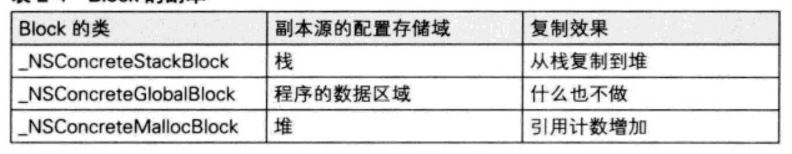
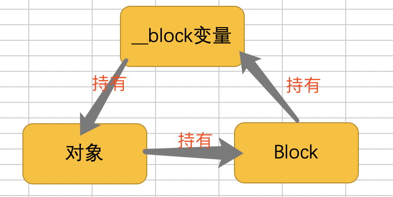

##Block分享

[toc]

### block的底层结构：
* block定义：block的本质是一个的OC对象，内部有一个isa指针，它封装了函数和调用函数所需要的参数，block中有一个变量捕获机制，正是因为这个变量捕获机制，block才能封装函数的调用环境。
* block的底层结构图：

###block的变量捕获(capture)
* 为了保证在block内部能够访问外部变量，block有个变量的捕获机制。block对局部变量和全局变量的访问方式是不同的
* auto：当前变量的作用域为当前函数或代码块内，当前变量时一个局部变量，当前变量会在栈区上进行分配存储空间。

* 在block中直接使用到成员变量也会捕获self。

###block的类型
* 可以通过调用class方法或者isa指针查看block的具体类型，最终都是继承NSBlock类型

* block的三种类型： 

| block的类型 				| 				环境         |
| 	  -------- 			| 			----- 	         |
| \_\_NSGlobalBlock__  | 	没有访问auto变量        |
| \_\_NSStackBlock__   |   访问了auto变量         |
| \_\_NSMallocBlock__  |    \_\_NSStackBlock__ 调用了copy之后   |

* block每种类型在内存中存储的区域：

* 在ARC环境下，编译器会根据情况自动将栈上的block复制到堆上
	* block作为函数的返回值时
	* block赋值给\_\_strong指针时
	* block作为Cocoa API中方法名含有usingBlock的方法参数时
	* block作为GCD API的方法参数时 

* MRC下block属性修饰关键字一定要使用copy：
	* @property (copy, nonatomic) void (^block)(void);
	
* ARC下Block属性修饰关键字建议使用copy(使用strong和使用copy的效果是一样的)：
	* @property (strong, nonatomic) void (^block)(void);
	* @property (copy, nonatomic) void (^block)(void);
	 
* 每种类型的block调用了多次copy之后：

* block内部访问了对象类型的auto变量时：
	* 如果block是在栈上的时候，不会对auto变量产生强引用
	* 如果block被copy到堆上的时候
		* 会调用block内部的copy函数，copy函数会调用_Block_object_assign函数
		* _Block_object_assign函数会根据auto变量的修饰符决定得是强引用或者弱引用。
		 
	* 如果block从堆上移除的时候
		* 会调用block内部的dispose函数,dispose函数会调用_Block_object_dispose函数 
		* _Block_object_dispose函数会自动对强引用的auto变量做一次release

---

### \_\_block的原理
* \_\_block的本质
	* \_\_block可以用来解决在block内部无法修改auto变量的问题，编译器会将__block修饰的变量封装成一个对象。
	* \_\_block只能用来修饰auto变量，不能修饰static 和全局变量

	* 捕获了OC对象或者捕获了使用__block修饰的临时变量的block结构体中为什么会有forwaring指针?

* block对__block变量的内存管理
	* block对__block变量的内存管理
	* 当block栈上的时候并不会对__block变量产生强引用。 当block被copy到堆上的时候会调用block内部的copy函数，copy函数会调用\_Block\_object\_assign函数，\_Block\_object\_assign函数会对\_\_block变量强引用。
	* 当block从堆中移除的时候，会调用block的dispose函数，dispose函数会调用_Block_object_dispose函数,\_\_Block\_object\_dispose函数会对\_\_block变量做一次release 
* \_\_block变量对修饰的对象类型的内存管理
	* \_\_block变量在栈上的时候不会对\_\_block内部的变量产生强引用
	* 当\_\_block变量被copy到堆上的时候 会调用\_\_block变量内部的copy方法。 copy方法会调用 \_\_Block\_object\_assign 函数，\_Block\_object\_assign函数会根据所指向对象的修饰符决定是强指针还是弱指针（仅仅是ARC环境下，在MRC环境下一定不会retain）
	* 当\_\_block变量从堆上移除的时候会调用\_\_block变量内部的dospose函数， dispose函数会调用\_Block_object_dispose，\_Block_object_dispose会对指向的对象做一次release

---

### block的循环引用
* block产生循环引用的原因
* 在block中使用了self或者成员变量

* \_\_block变量产生的循环引用
* \_\_block变量持有对象
* 对象持有block
* block持有__block

* 解决block的循环引用的方法
* 在ARC下的方法：

	1. \_\_weak、\_\_unsafe_unretained 关键字来解决循环引用
	2. 使用\_\_block变量来解决循环引用（必须要调用block）

* 在MRC下的方法
	* 使用\_\_unsafe_unretained 或者\_\_block来解决循环引用 

### 其他
* 使用clang 将OC代码转换为C++代码
* 

* block源码地址
[点击这里下载](https://opensource.apple.com/tarballs/libclosure/)

