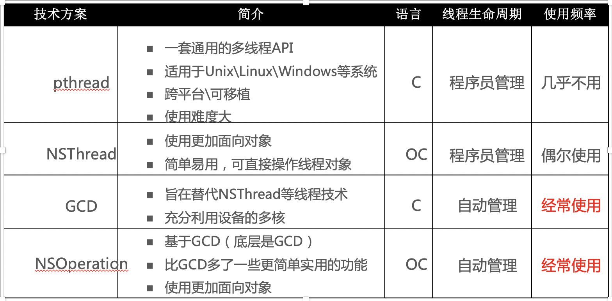
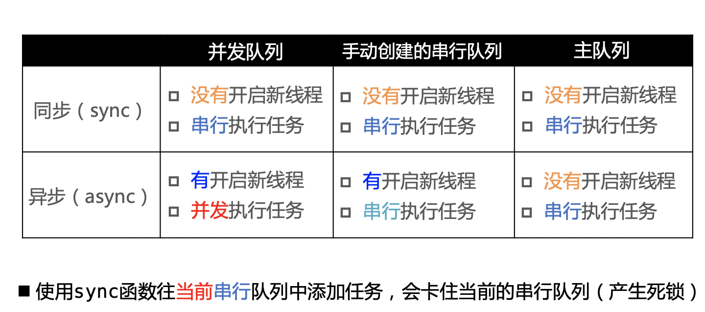
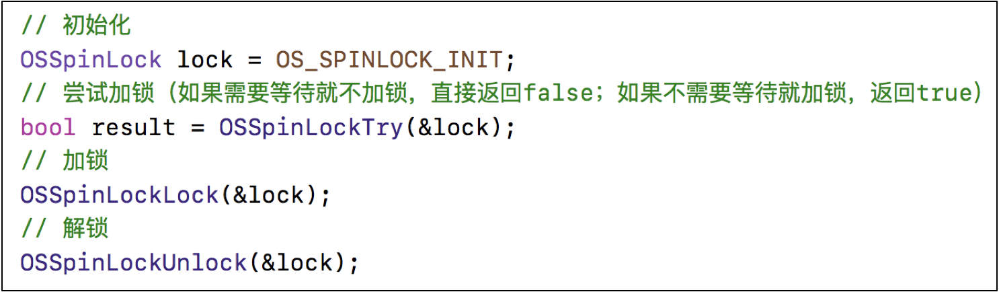

#iOS多线程整理

##iOS中使用多线程的方式


## GCD
[GCD源码](https://github.com/apple/swift-corelibs-libdispatch)

###同步，异步，并发，串行，的介绍
* GCD中可以通过`同步`或者`异步`的方式来执行任务

```
// 同步方式执行
dispatch_sync(dispatch_queue_t queue, dispatch_block_t block);
// 异步方式执行
dispatch_async(dispatch_queue_t queue, dispatch_block_t block);
```
* GCD中的队列可以分为2种类型
	* `并发`队列
		* 可以让多个任务同时并发执行，会自动开启多个线程执行任务
		* 并发功能只有在异步函数下才有用 
	* `串行`队列
		* 让任务一个接着一个执行，(一个任务执行完毕后，在执行下一个任务)
* 同步和异步主要影响：能不能开启新的线程
	* 同步：在当前线程中先执行任务，不会开启新的线程 
	* 异步：在新的线程中执行任务，当前线程继续执行任务，具有开启线程的能力
* 串行和并发主要影响：任务的执行方式 
	* 串行：一个任务执行完毕，在继续执行另外一个任务
	* 并发：多个任务并发同时执行 
* 总结：


###GCD中队列组的使用
###多线程的安全隐患
###iOS中的线程同步方案
###iOS中锁的介绍

##### OSSpinLock ：自旋锁,
* 等待锁的线程会处于忙等状态，会一直占用着cpu的资源
* 目前已经不安全，可能会出现优先级反转的问题.（优先级反转：如果等待锁的线程优先级线程比较高，它会一直占用着cpu的资源，优先级低的线程就无法释放锁 ）

##### os_unfair_lock：官方推荐替代OSSpinLock的替代方案，解决了优先级反转的问题，iOS10.0之上才可以调用

