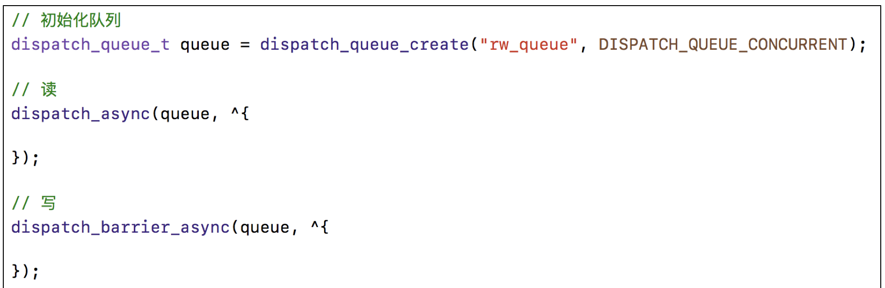

#iOS多线程整理

##iOS中使用多线程的方式


## GCD
[GCD源码](https://github.com/apple/swift-corelibs-libdispatch)

###同步，异步，并发，串行，的介绍
* GCD中可以通过`同步`或者`异步`的方式来执行任务

```
// 同步方式执行
dispatch_sync(dispatch_queue_t queue, dispatch_block_t block);
// 异步方式执行
dispatch_async(dispatch_queue_t queue, dispatch_block_t block);
```
* GCD中的队列可以分为2种类型
	* `并发`队列
		* 可以让多个任务同时并发执行，会自动开启多个线程执行任务
		* 并发功能只有在异步函数下才有用 
	* `串行`队列
		* 让任务一个接着一个执行，(一个任务执行完毕后，在执行下一个任务)
* 同步和异步主要影响：能不能开启新的线程
	* 同步：在当前线程中先执行任务，不会开启新的线程 
	* 异步：在新的线程中执行任务，当前线程继续执行任务，具有开启线程的能力
* 串行和并发主要影响：任务的执行方式 
	* 串行：一个任务执行完毕，在继续执行另外一个任务
	* 并发：多个任务并发同时执行 
* 总结：


###GCD中队列组的使用
###多线程的安全隐患
###iOS中的线程同步方案

###iOS中锁的介绍

##### OSSpinLock ：自旋锁,
* 等待锁的线程会处于忙等状态，会一直占用着cpu的资源
* 目前已经不安全，可能会出现优先级反转的问题.（优先级反转：如果等待锁的线程优先级线程比较高，它会一直占用着cpu的资源，优先级低的线程就无法释放锁 ）
* 需要导入头文件#import <libkern/OSAtomic.h>

##### os_unfair_lock：互斥锁，官方推荐替代OSSpinLock的替代方案，解决了优先级反转的问题，iOS10.0之上才可以使用
* 等待os_unfair_lock锁的线程会处于休眠状态，并非忙等
* 需要导入头文件#import <os/lock.h>


##### pthread_mutex：
* 互斥锁 等待锁的过程会处于休眠状态
	
* 递归锁
	
* 条件锁
	
	
##### NSLock是对mutex普通锁的封装
##### NSRecursiveLock是对mutex递归锁的封装Api和NSLock一样
##### NSCondition是对mutex和cond的封装
##### NSConditionLock是对NSCondition的进一步封装，可以设置具体的条件值(可以用来解决线程之间的依赖关系)
##### 解决多线程同步问题不一定非要使用锁，也可以使用串行队列来解决
##### dispatch_semaphore
* semaphore 叫信号量
* 信号量的初始值，可以用来控制线程并发访问的最大数量
* 信号量的初始值为1表示同时只允许1条线程访问资源

##### @synchronized
* @synchronized 是对mutex递归锁的封装
* @synchronized(obj) 内部会生成obj对应的递归锁，然后进行加锁和解锁操作，可以查看objc4中的objc-sync.mm源码

### 线程同步方案性能高低排序


### atomic
* atomic用于保证属性setter,getter的原子性操作，相当于在getter和setter内部加了线程同步锁
* 源码在objc4的objc-accessors.mm 中
* 它不能保证使用的属性过程是线程安全的。

### iOS中的读写安全方案（多读，单写，用于文件数据读写操作）
* 同一时间只允许有1个线程进行写的操作
* 同一时间，允许有多个线程进行读的操作
* 同一时间，不允许即有写的操作，有有读的操作

#### pthread_rwlock：读写锁
* 等待锁的线程会进入休眠


#### dispatch_brrier_async : 异步栅栏调用
* 这个函数传入的并发队列必须是自己通过dispatch_queue_create创建的
* 如果传入的是一个串行或者是一个全局的并发队列，那么这个函数和dispatch_async函数的效果一样。


